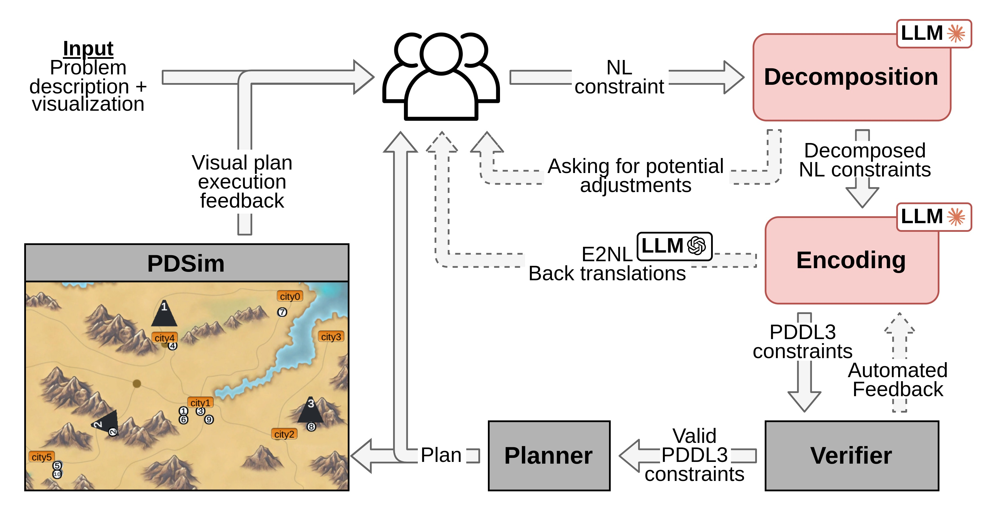

# CAI: Collaborative AI Agent

Human in the Loop constraint planning 
CAI 

## Overview



Preliminary version for ONR CAI
Mix of Phase 2 and 3

## Installation

Tested on Ubuntu 20.04

#### > Dependencies: Virtual Environment
Create a python3.10 environment to install the relevant dependencies:
```
python3.10 -m venv env_cai
source env_cai/bin/activate
pip install -r requirements.txt --no-cache-dir
sudo apt-get install openjdk-17-jdk python3.10-tk
```

Run a small patch for unified_planning to also handle default _real_ and _int_ values:
```
python patch_unified_planning_default_values.py 
```

**Note**: to deactivate the python environment simply run: `deactivate`

#### > NTCORE: Numeric constraints compilation


**Note**: Conflicting command line management in `NumericTCORE/bin/ntcore.py`, already solved by commenting `@click.command()`.

Install the package:
```
cd NumericTCORE/
pip install .
```

#### > ENHSP: Planner 

Compile the planner by running:
```
cd ENHSP-Public
./compile
```

Ignore the two _Note_ lines.

#### > LLM API: Set up Claude API key

Replace `REPLACE_WITH_YOUR_KEY` in `.env`.  


## Run CAI with GUI

Activate virtual environment:
```
source env_cai/bin/activate
python main.py [OPTIONS] PROBLEM_NAME
```

Problems and options can be listed using `python main.py --help`.

---


### Run CAI in shell

```
source env_cai/bin/activate
python cai.py [OPTIONS] PROBLEM_NAME
```

Problems and options can be listed using `python cai.py --help`.

To add new problems, see `defs.py`.

The planning mode used (i.e. optimal, satisficing, default) can be used using the respective options `-o`, `-s`, `-d`.


### Run Planner Only

You can also directly run the planner, only.
```
source env_cai/bin/activate
python planner.py [OPTIONS] PROBLEM_NAME
```

Problems and options can be listed using `python planner.py --help`

You can either use the original files corresponding to the given problem name or plan using the last compiled files using `-c`.

The planning mode used (i.e. optimal, satisficing, default) can be used using the respective options `-o`, `-s`, `-d`.
